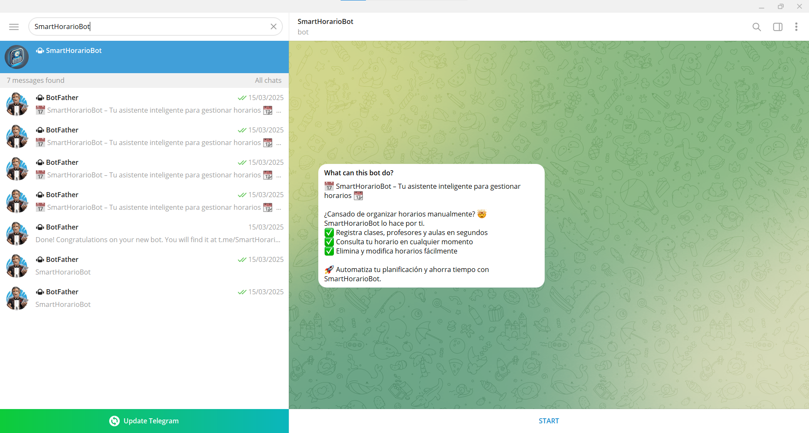
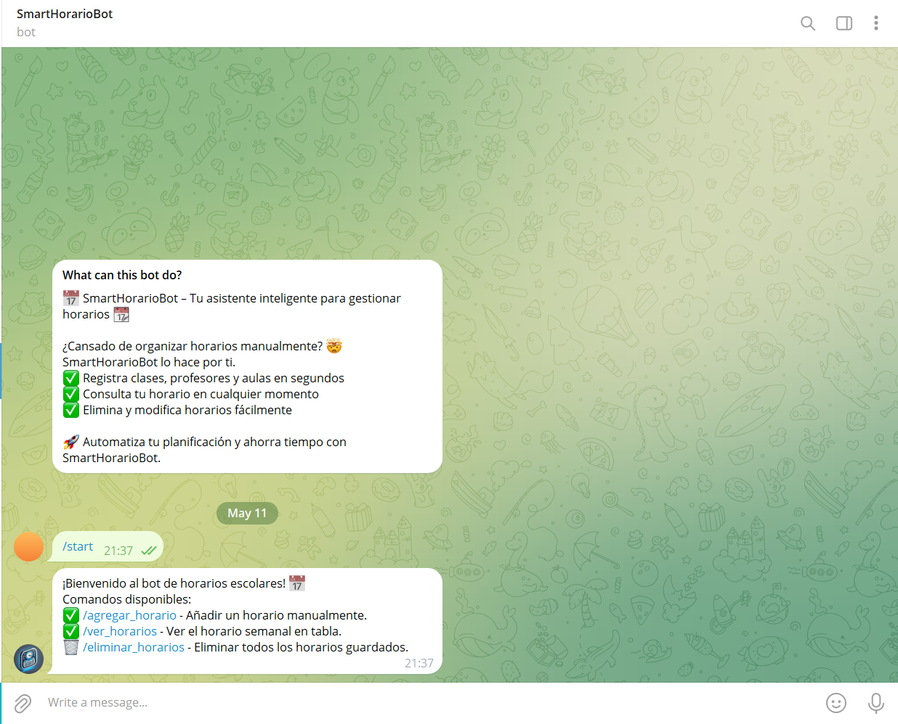
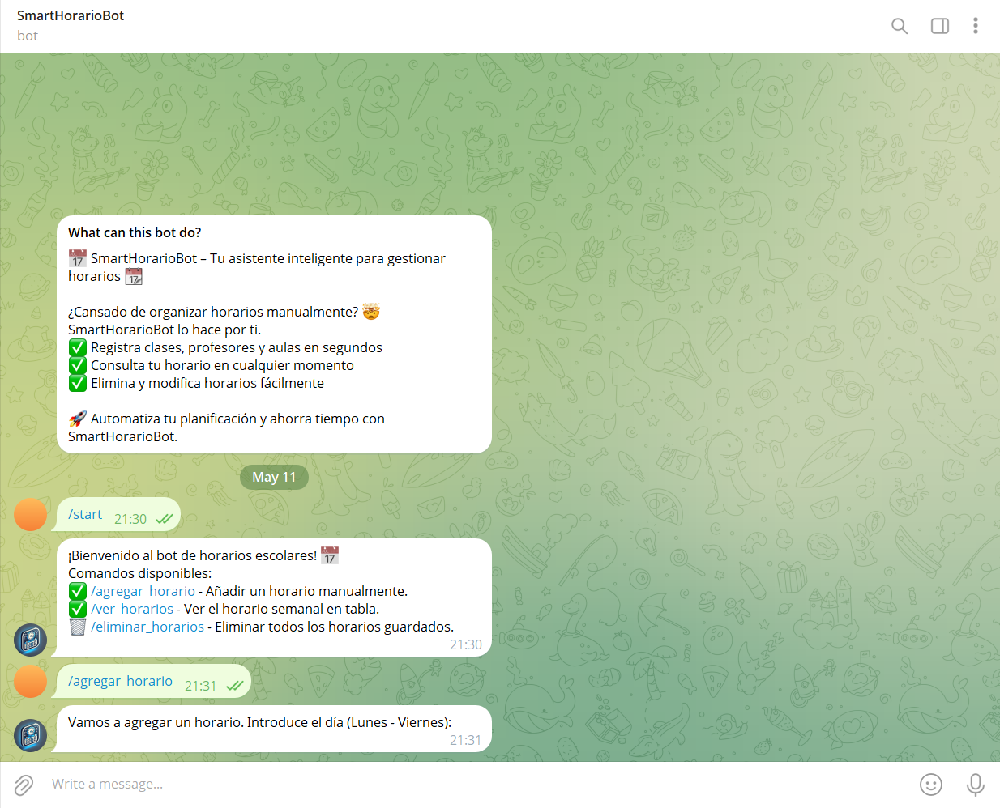
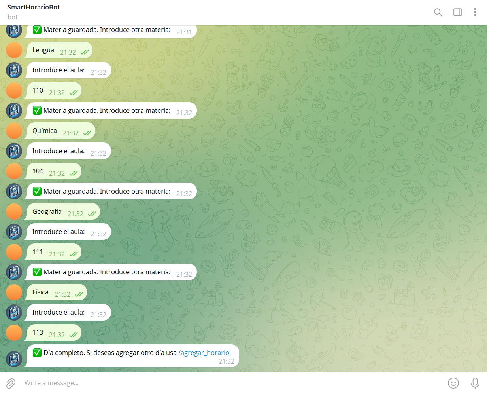
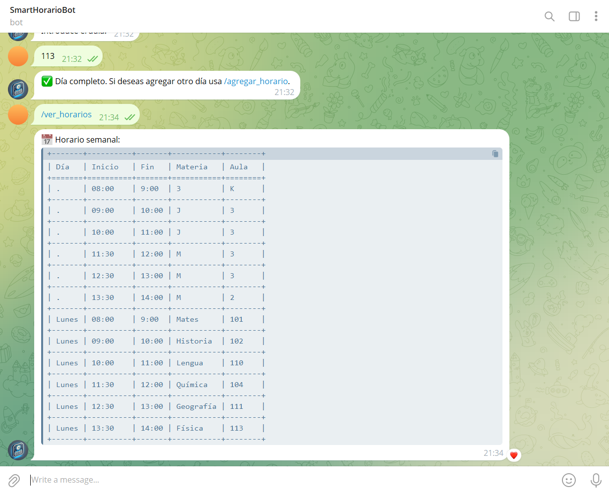
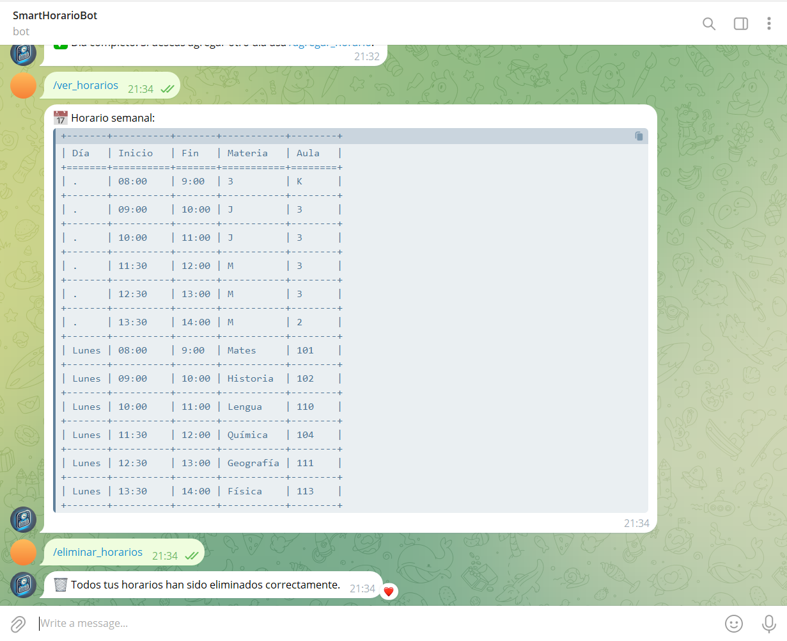
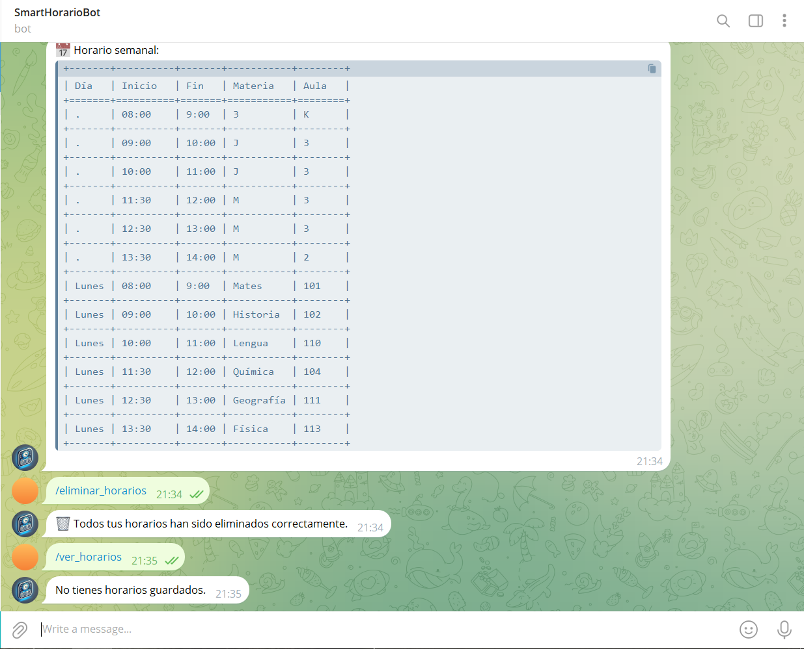

# 🧪 Demo del Proyecto - SmartHorarioBot

Esta demo muestra cómo funciona el bot de Telegram `SmartHorarioBot`, incluyendo ejemplos reales de uso a través de capturas de pantalla.

---

## 🚀 Iniciar el bot

El usuario busca el bot en Telegram e inicia la conversación clickando en "START":

Aparecerán los comandos disponibles:

---

## ➕ Agregar un horario

Al escribir `/agregar_horario`, el bot solicita los datos necesarios (día, asignatura, aula, hora...):

Cuando se termina de introducir las 6 materias y aulas el bot también te sugiere agregar otro día

---

## 📋 Ver los horarios creados

El usuario puede ver los horarios guardados mediante `/ver_horarios`:

---

## 🗑️ Eliminar todos los horarios

También se puede eliminar toda la información con `/eliminar_horarios`:

Ahora al ver de nuevo los horarios, el bot te indica que no tienes horarios guardados

---
